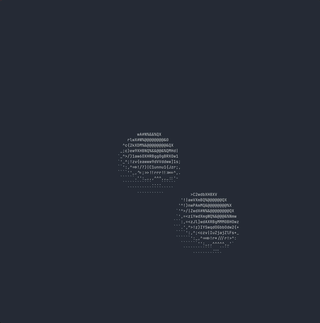

# 🌲 *Cupressa* - ascii 3D

Cupressa is bunch of code that make geometrical form in ascii using sphere-tracing, mimicking glsl syntax.

It is written in rust, using crossterm for the io interaction.

SVFs are from [Inigo Quilez website](https://iquilezles.org/articles/distfunctions/)

The gradient String is 
```text
" `.-':_,^=;><+!rc*/z?sLTv)J7(|Fi{C}fI31tlu[neoZ5Yxjya]2ESwqkP6h9d4VpOGbUAKXHm8RD#$Bg0MNWQ%&@"
```

I stole it on [this SO](https://stackoverflow.com/questions/30097953/ascii-art-sorting-an-array-of-ascii-characters-by-brightness-levels-c-c)


(the gif is laggy)

*Cupressaceae* is a conifer family. At first, the name should have been *Cryptomeria*, but I didn't want people to mistake this for a crypto currency project...